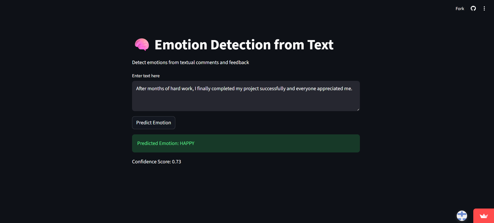
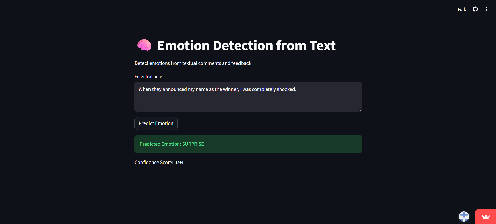

# 🧠 Emotion Detection from Text using BERT

An NLP-based web application that detects **human emotions from text** using a fine-tuned BERT (Bidirectional Encoder Representations from Transformers) model and provides real-time predictions through a Streamlit interface.

---

## 📌 Project Overview

Human communication is not just words — it contains emotions. Understanding emotions from text is an important task in Artificial Intelligence, used in chatbots, customer service systems, and mental-health monitoring tools.

This project builds an **Emotion Detection System** that automatically identifies the emotion expressed in a sentence or paragraph entered by the user.

Unlike traditional machine learning models (Naive Bayes, SVM), this system uses **BERT Transformer**, which understands contextual meaning.

Example:

> “I am fine”
> can be neutral or sad depending on context — BERT captures this.

---

## 🎯 Objectives

* Detect emotions from textual input
* Apply Deep Learning (BERT) for contextual understanding
* Provide real-time prediction interface
* Demonstrate practical NLP application

---

## 😊 Emotion Classes

The model predicts 6 emotions:

* HAPPY
* SAD
* ANGRY
* LOVE
* SURPRISE
* NEUTRAL

---

## 🖼️ Emotion Prediction Samples

### 😄 Happy



### 😢 Sad


### 😲 Surprise



### 😐 Neutral


---

## 🏗️ Tech Stack

| Component            | Technology                         |
| -------------------- | ---------------------------------- |
| Programming Language | Python                             |
| NLP Model            | BERT Transformer                   |
| Framework            | PyTorch / HuggingFace Transformers |
| Frontend             | Streamlit                          |
| Data Handling        | Pandas, NumPy                      |
| Deployment           | Localhost                          |

---

## 📂 Project Structure

```
Emotion-Detection-TCS/
│
├── streamlit_app.py
├── tcs_happy.png
├── tcs_sad.png
├── tcs_surprise.png
├── tcs_neutral.png
├── requirements.txt
└── README.md
```

---

## ⚙️ Installation & Setup

### 1️⃣ Clone Repository

```bash
git clone https://github.com/Fidel876/Emotion-Detection-TCS.git
cd Emotion-Detection-TCS
```

### 2️⃣ Create Virtual Environment

**Windows**

```bash
python -m venv venv
venv\Scripts\activate
```

**Linux / Mac**

```bash
python3 -m venv venv
source venv/bin/activate
```

### 3️⃣ Install Dependencies

```bash
pip install -r requirements.txt
```

---

## ▶️ Run the Application

```bash
streamlit run streamlit_app.py
```

Then open:

```
http://localhost:8501
```

---

## 💻 How It Works

1. User enters text
2. Text is preprocessed
3. BERT tokenizer converts text to tokens
4. Fine-tuned BERT analyzes context
5. Emotion is predicted
6. Confidence score displayed

---

## 🧪 Example Inputs

| Input                    | Prediction |
| ------------------------ | ---------- |
| I got a job today!       | HAPPY      |
| I feel very lonely       | SAD        |
| Why did you do that?!    | ANGRY      |
| Wow I didn't expect this | SURPRISE   |
| I am going to college    | NEUTRAL    |

---

## ✨ Features

* Real-time emotion detection
* Context-aware prediction
* Supports long text
* Streamlit user interface
* Confidence score output

---

## 📊 Applications

* Social media analysis
* Customer feedback monitoring
* Mental health chatbots
* AI assistants
* Review classification

---

## 🚀 Future Improvements

* Speech emotion detection
* Multilingual support
* Cloud deployment (AWS/Azure)

---

## 👨‍💻 Author

**Fidel M**
Artificial Intelligence & Data Science

---

## ⭐ Acknowledgement

Developed as part of internship/academic learning to demonstrate practical implementation of NLP and Deep Learning.
